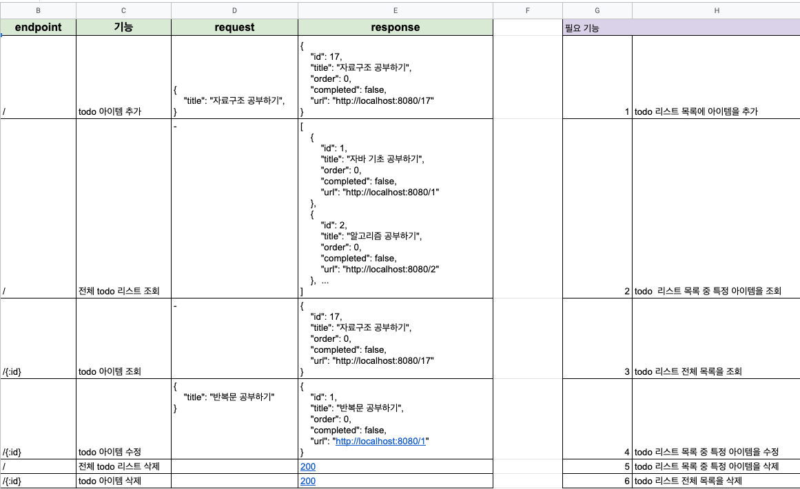

# todo-server

## 기술스택
  * 언어: Java 15
  * IDE: IntelliJ
  * build: Gradle
  * FrameWork: Spring Boot, Spring Data Jpa, Spring Data Rest
  * ORM: JPA
  * Database: H2
  * 테스트: Mock, Junit5

## 요구사항 정리
|seq|필요기능|
|---|---|
|1|todo 리스트 목록에 아이템을 추가|
|2|todo 리스트 목록 중 특정 아이템을 조회|
|3|todo 리스트 전체 목록을 조회|
|4|todo 리스트 목록 중 특정 아이템을 수정|
|5|todo 리스트 목록 중 특정 아이템을 삭제|
|6|todo 리스트 전체 목록을 삭제|

## API 스펙


## 환경설정 및 프로젝트 세팅
* build.gradle
``` bash
  plugins {
    id 'org.springframework.boot' version '2.4.2'
    id 'io.spring.dependency-management' version '1.0.11.RELEASE'
    id 'java'
}

group 'org.example'
version '1.0-SNAPSHOT'

repositories {
    mavenCentral()
}

dependencies {
    implementation 'org.springframework.boot:spring-boot-starter-data-rest:2.5.3'
    implementation 'org.springframework.boot:spring-boot-starter-data-jpa:2.5.3'

    runtimeOnly 'com.h2database:h2:1.4.200'

    annotationProcessor('org.projectlombok:lombok:1.18.20')
    compileOnly('org.projectlombok:lombok:1.18.20')

    testImplementation('org.springframework.boot:spring-boot-starter-test:2.5.3')
}

test {
    useJUnitPlatform()
}
```

## 모델 구현
* TodoEntity.java
``` java
package org.example.model;

import lombok.AllArgsConstructor;
import lombok.Data;
import lombok.NoArgsConstructor;

import javax.persistence.*;

@Data
@Entity
@NoArgsConstructor
@AllArgsConstructor
public class TodoEntity {

    @Id
    @GeneratedValue(strategy = GenerationType.IDENTITY)
    private Long id;

    @Column(nullable = false)
    private String title;

    @Column(name = "todoOrder", nullable = false)
    private Long order;

    @Column(nullable = false)
    private Boolean completed;
}

```

* TodoRequest.java
``` java
package org.example.model;

import lombok.AllArgsConstructor;
import lombok.Data;
import lombok.NoArgsConstructor;

@Data
@NoArgsConstructor
@AllArgsConstructor
public class TodoRequest {

    private String title;

    private Long order;

    private Boolean completed;
}

```

* TodoResponse.java
``` java
package org.example.model;

import lombok.AllArgsConstructor;
import lombok.Data;
import lombok.NoArgsConstructor;

@Data
@NoArgsConstructor
@AllArgsConstructor
public class TodoResponse {

    private Long id;

    private String title;

    private Long order;

    private Boolean completed;

    private String url;

    public TodoResponse(TodoEntity todoEntity) {
        this.id = todoEntity.getId();
        this.title = todoEntity.getTitle();
        this.order = todoEntity.getOrder();
        this.completed = todoEntity.getCompleted();

        this.url = "http://localhost:8080/" + this.id;
    }
}

```

## repository 구현
``` java
package org.example.repository;

import org.example.model.TodoEntity;
import org.springframework.data.jpa.repository.JpaRepository;
import org.springframework.stereotype.Repository;

@Repository
public interface TodoRepository extends JpaRepository<TodoEntity, Long> {

}

```

## 서비스 코드 구현
* TodoRepository.java
``` java
package org.example.service;

import lombok.AllArgsConstructor;
import org.example.model.TodoEntity;
import org.example.model.TodoRequest;
import org.example.repository.TodoRepository;
import org.springframework.http.HttpStatus;
import org.springframework.stereotype.Service;
import org.springframework.web.server.ResponseStatusException;

import java.util.List;

@Service
@AllArgsConstructor
public class TodoService {

    private final TodoRepository todoRepository;

    public TodoEntity add(TodoRequest request) {
        TodoEntity todoEntity = new TodoEntity();
        todoEntity.setTitle(request.getTitle());
        todoEntity.setOrder(request.getOrder());
        todoEntity.setCompleted(request.getCompleted());
        return this.todoRepository.save(todoEntity);
    }

    public TodoEntity searchById(Long id) {
         return this.todoRepository.findById(id)
                    .orElseThrow(() -> new ResponseStatusException(HttpStatus.NOT_FOUND));
    }

    public List<TodoEntity> searchAll() {
        return this.todoRepository.findAll();
    }

    public TodoEntity updateById(Long id, TodoRequest request) {
        TodoEntity todoEntity = this.searchById(id);
        if (request.getTitle() != null) {
            todoEntity.setTitle(request.getTitle());
        }
        if (request.getOrder() != null) {
            todoEntity.setOrder(request.getOrder());
        }
        if (request.getCompleted() != null) {
            todoEntity.setCompleted(request.getCompleted());
        }
        return this.todoRepository.save(todoEntity);
    }

    public void deleteById(Long id) {
        this.todoRepository.deleteById(id);
    }

    public void deleteAll() {
        this.todoRepository.deleteAll();
    }
}

```

## 컨트롤러 구현
* TodoController.java
``` java
package org.example.controller;

import lombok.AllArgsConstructor;
import org.example.model.TodoEntity;
import org.example.model.TodoRequest;
import org.example.model.TodoResponse;
import org.example.service.TodoService;
import org.springframework.http.ResponseEntity;
import org.springframework.util.ObjectUtils;
import org.springframework.web.bind.annotation.*;

import java.util.List;
import java.util.stream.Collectors;

@CrossOrigin
@AllArgsConstructor
@RestController
@RequestMapping("/")
public class TodoController {

    private final TodoService service;

    @PostMapping
    public ResponseEntity<TodoResponse> create(@RequestBody TodoRequest request) {
        System.out.println("CREATE");

        if (ObjectUtils.isEmpty(request.getTitle())) {
            return ResponseEntity.badRequest().build();
        }

        if (ObjectUtils.isEmpty(request.getOrder())) {
            request.setOrder(0L);
        }

        if (ObjectUtils.isEmpty(request.getCompleted())) {
            request.setCompleted(false);
        }

        TodoEntity result = this.service.add(request);
        return ResponseEntity.ok(new TodoResponse(result));
    }

    @GetMapping("{id}")
    public ResponseEntity<TodoResponse> readOne(@PathVariable Long id) {
        System.out.println("READ ONE");
        TodoEntity result = this.service.searchById(id);
        return ResponseEntity.ok(new TodoResponse(result));
    }

    @GetMapping
    public ResponseEntity<List<TodoResponse>> readAll() {
        System.out.println("READ ALL");
        List<TodoEntity> list = this.service.searchAll();
        List<TodoResponse> responses = list.stream().map(TodoResponse::new).collect(Collectors.toList());
        return ResponseEntity.ok(responses);
    }

    @PatchMapping("{id}")
    public ResponseEntity<TodoResponse> update(@PathVariable Long id, @RequestBody TodoRequest request) {
        System.out.println("UPDATE");
        TodoEntity result = this.service.updateById(id, request);
        return ResponseEntity.ok(new TodoResponse(result));
    }

    @DeleteMapping("{id}")
    public ResponseEntity<?> deleteOne(@PathVariable Long id) {
        System.out.println("DELETE");
        this.service.deleteById(id);
        return ResponseEntity.ok().build();
    }

    @DeleteMapping
    public ResponseEntity<?> deleteAll() {
        System.out.println("DELETE ALL");
        this.service.deleteAll();
        return ResponseEntity.ok().build();
    }
}

```

## 테스트 코드 구현
* TodoServiceTest.java
``` java
package org.example.service;

import org.example.model.TodoEntity;
import org.example.model.TodoRequest;
import org.example.repository.TodoRepository;
import org.junit.jupiter.api.Test;
import org.junit.jupiter.api.extension.ExtendWith;
import org.mockito.AdditionalAnswers;
import org.mockito.InjectMocks;
import org.mockito.Mock;
import org.mockito.junit.jupiter.MockitoExtension;
import org.springframework.web.server.ResponseStatusException;

import java.util.Optional;

import static org.junit.jupiter.api.Assertions.assertEquals;
import static org.junit.jupiter.api.Assertions.assertThrows;
import static org.mockito.ArgumentMatchers.any;
import static org.mockito.ArgumentMatchers.anyLong;
import static org.mockito.BDDMockito.given;
import static org.mockito.Mockito.when;

@ExtendWith(MockitoExtension.class)
class TodoServiceTest {

    @Mock
    private TodoRepository todoRepository;

    @InjectMocks
    private TodoService todoService;

    @Test
    void add() {
        when(this.todoRepository.save(any(TodoEntity.class)))
                .then(AdditionalAnswers.returnsFirstArg());

        TodoRequest expected = new TodoRequest();
        expected.setTitle("Test Title");

        TodoEntity actual = this.todoService.add(expected);

        assertEquals(expected.getTitle(), actual.getTitle());
    }

    @Test
    void searchById() {
        TodoEntity entity = new TodoEntity();
        entity.setId(123L);
        entity.setTitle("TITLE");
        entity.setOrder(0L);
        entity.setCompleted(false);
        Optional<TodoEntity> optional = Optional.of(entity);
        given(this.todoRepository.findById(anyLong()))
                .willReturn(optional);
        TodoEntity actual = this.todoService.searchById(123L);

        TodoEntity expected = optional.get();

        assertEquals(expected.getId(), actual.getId());
        assertEquals(expected.getTitle(), actual.getTitle());
        assertEquals(expected.getOrder(), actual.getOrder());
        assertEquals(expected.getCompleted(), actual.getCompleted());
    }

    @Test
    public void searchByIdFailed() {
        given(this.todoRepository.findById(anyLong()))
                .willReturn(Optional.empty());

        assertThrows(ResponseStatusException.class, () -> {
            this.todoService.searchById(123L);
        });
    }
}
```

* TodoControllerTest.java
``` java
package org.example.controller;

import com.fasterxml.jackson.databind.ObjectMapper;
import org.example.model.TodoEntity;
import org.example.model.TodoRequest;
import org.example.service.TodoService;
import org.junit.jupiter.api.BeforeEach;
import org.junit.jupiter.api.Test;
import org.springframework.beans.factory.annotation.Autowired;
import org.springframework.boot.test.autoconfigure.web.servlet.WebMvcTest;
import org.springframework.boot.test.mock.mockito.MockBean;
import org.springframework.http.MediaType;
import org.springframework.test.web.servlet.MockMvc;

import static org.junit.jupiter.api.Assertions.*;
import static org.mockito.ArgumentMatchers.any;
import static org.mockito.ArgumentMatchers.endsWith;
import static org.mockito.Mockito.when;
import static org.springframework.test.web.servlet.request.MockMvcRequestBuilders.post;
import static org.springframework.test.web.servlet.result.MockMvcResultMatchers.jsonPath;
import static org.springframework.test.web.servlet.result.MockMvcResultMatchers.status;

@WebMvcTest(TodoController.class)
class TodoControllerTest {

    @Autowired
    MockMvc mvc;

    @MockBean
    TodoService todoService;

    private TodoEntity expected;

    @BeforeEach
    void setup() {
        this.expected = new TodoEntity();
        this.expected.setId(123L);
        this.expected.setTitle("TEST TITLE");
        this.expected.setOrder(0L);
        this.expected.setCompleted(false);
    }

    @Test
    void create() throws Exception {
        when(this.todoService.add(any(TodoRequest.class)))
                .then((i) -> {
                    TodoRequest request = i.getArgument(0, TodoRequest.class);
                    return new TodoEntity(this.expected.getId(), request.getTitle(), this.expected.getOrder(), this.expected.getCompleted());
                });

        TodoRequest request = new TodoRequest();
        request.setTitle("ANY TITLE");

        ObjectMapper mapper = new ObjectMapper();
        String content = mapper.writeValueAsString(request);

        this.mvc.perform(post("/").contentType(MediaType.APPLICATION_JSON).content(content))
                .andExpect(status().isOk())
                .andExpect(jsonPath("$.title").value("ANY TITLE"));
    }
}
```


